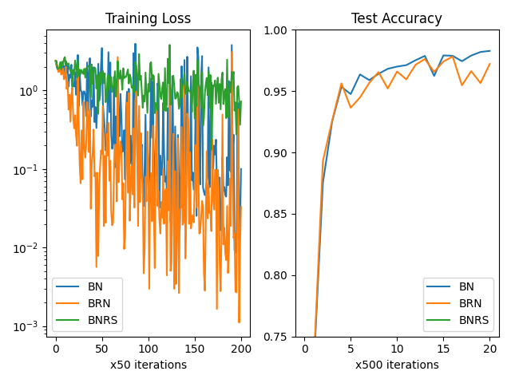
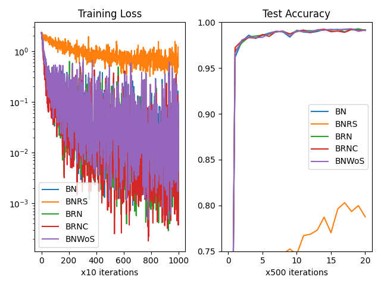
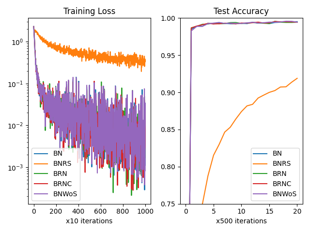
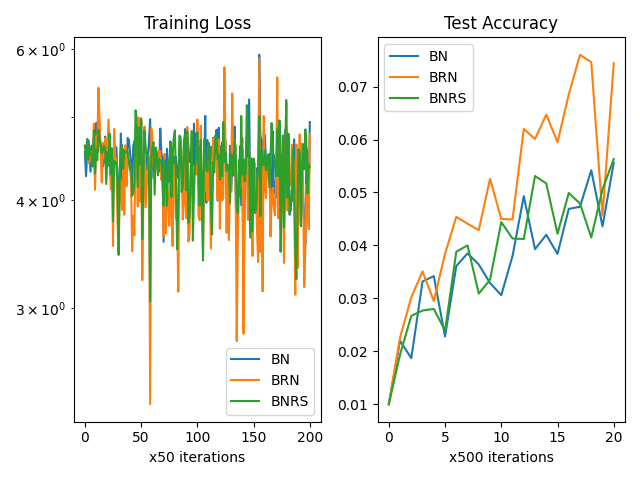
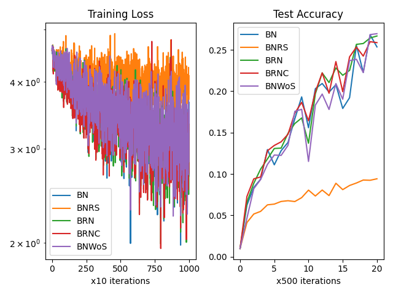
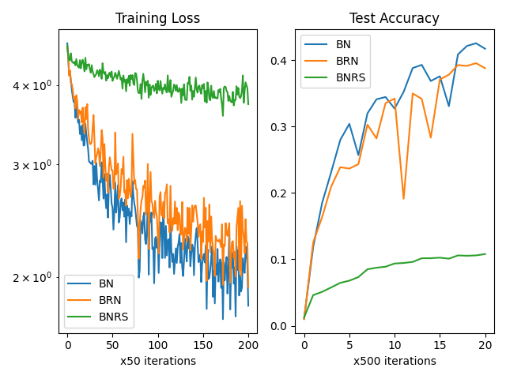

# Why don't we simply use running statistics for batch normalization training?

This repository contains a study that compares the use of three different batch normalization methods (BN, BNRS, and BRN) on image classification datasets with small and large batch sizes.

## Methods

### Method 1: BatchNorm (BN)

BN is the same as the PyTorch implementation and uses batch statistics for normalization during training, with running statistics reserved for inference only.

### Method 2: BatchNorm with Running Statistics (BNRS)

BNRS always uses running statistics during both training and inference, and only uses batch statistics to update running statistics without computing any gradients.

### Method 3: [Batch ReNormalization (BRN)](https://arxiv.org/pdf/1702.03275.pdf)

BRN appears to use running statistics in both training and inference, but it also employs the gradients of batch statistics during training.

## Results

### MNIST

| BS=2                                  | 16                                     | 128                                     |
| ------------------------------------- | -------------------------------------- | --------------------------------------- |
|  |  |  |

### CIFAR100

| BS=2                                     | 16                                        | 128                                        |
| ---------------------------------------- | ----------------------------------------- | ------------------------------------------ |
|  |  |  |

## Summary

In general, BRN performs better than BN only when the batch size is small (e.g. 2) and the task is challenging (e.g. CIFAR100). Otherwise, it is best to simply use BN. BNRS, on the other hand, tends to converge much slower and should be avoided.

# Credits

- https://arxiv.org/pdf/1702.03275.pdf.
- ChatGPT for refining the `README.md`.
