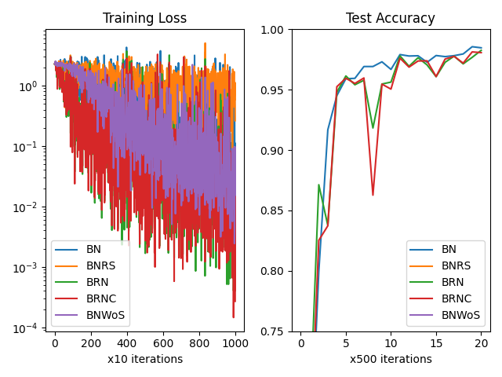
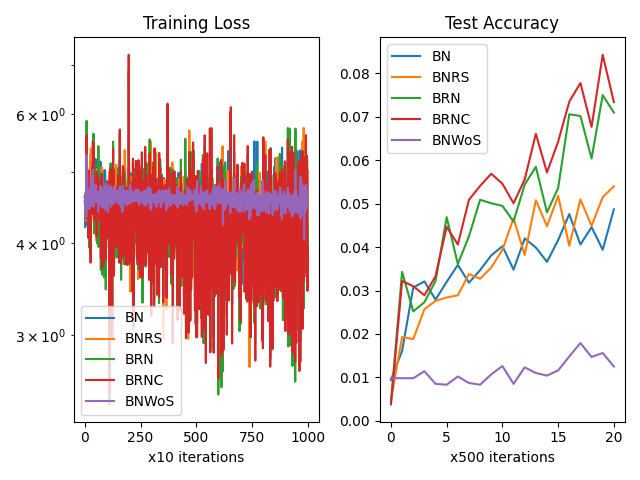
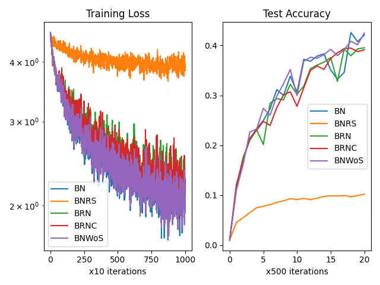

# Why don't we simply use running statistics for batch normalization training?

This repository contains a study that compares the use of three different batch normalization methods (BN, BNRS, and BRN) on image classification datasets with small and large batch sizes.

## Methods

### Method 1: BatchNorm (BN)

BN is the same as the PyTorch implementation and uses batch statistics for normalization during training, with running statistics reserved for inference only.

### Method 2: BatchNorm with Running Statistics (BNRS)

BNRS always uses running statistics during both training and inference, and only uses batch statistics to update running statistics without computing any gradients.

### Method 3: [Batch ReNormalization (BRN)](https://arxiv.org/pdf/1702.03275.pdf)

BRN appears to use running statistics in both training and inference but also utilizes the gradients of batch statistics during training.

## Results

### MNIST

| Batch Size |                                         |
| ---------- | --------------------------------------- |
| 2          |    |
| 16         |   |
| 128        |  |

### CIFAR100

| Batch Size |                                            |
| ---------- | ------------------------------------------ |
| 2          |    |
| 16         |   |
| 128        |  |

# Credits

- https://arxiv.org/pdf/1702.03275.pdf.
- ChatGPT for refining the `README.md`.
